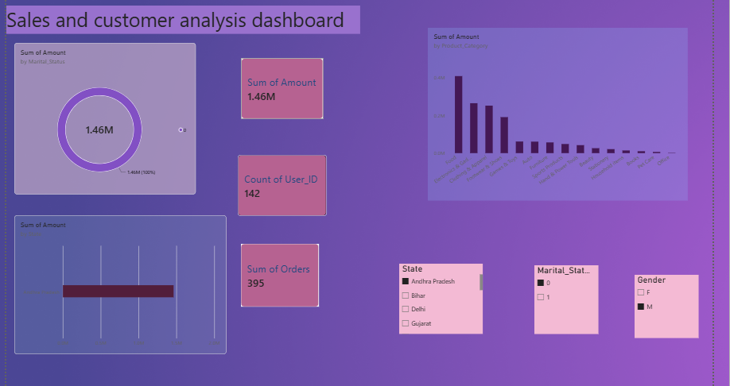

# Diwali Sales Data Analysis

##  Project Overview

This project focuses on analyzing Diwali sales data to understand customer purchasing patterns, sales performance, and product trends.

The project includes data cleaning using Python and Pandas, data analysis, and an interactive dashboard created using Microsoft Power BI.

---

##  Problem Statement

The objective of this project is to analyze Diwali sales data to understand customer purchasing patterns, identify high-performing product categories and states, and generate meaningful business insights that can help in understanding sales performance.

---

##  Dataset

The dataset contains Diwali sales transaction information, including:

- Customer details
- Gender
- Age and Age Group
- Marital Status
- State
- Zone
- Occupation
- Product Category
- Orders
- Purchase Amount

The original dataset contains 11,251 records and 15 columns.

---

## Data Cleaning

The data was cleaned using Python and Pandas.

The following steps were performed:

- Checked missing values
- Checked duplicate records
- Identified unnecessary columns
- Handled missing values
- Checked and corrected data types
- Standardized Gender values
- Converted Gender values from F/M to Female/Male
- Converted Marital Status values from 0/1 to No/Yes
- Prepared the cleaned dataset for analysis

---

## Data Analysis

The cleaned dataset was analyzed to identify patterns and trends in sales.

The analysis included:

- Sales by Gender
- Sales by Age Group
- Sales by State
- Sales by Zone
- Sales by Product Category
- Order and Purchase Amount analysis

---

## Power BI Dashboard

An interactive dashboard was created using Microsoft Power BI.

The dashboard includes:

- Key Performance Indicators (KPIs)
- Sales analysis by Product Category
- Sales analysis by State
- Sales analysis by Gender
- Sales analysis by Age Group
- Interactive slicers and filters

### Dashboard Preview


---

## Key Insights

The analysis provided the following insights:

- Female customers contributed a larger share of the total purchase amount in the dataset.
- The 26–35 age group recorded the highest purchase amount.
- Uttar Pradesh recorded the highest purchase amount among the states.
- Food was the highest-performing product category by purchase amount.
- The Central zone recorded the highest purchase amount.


##  Tools & Technologies

- Python
- Pandas
- Jupyter Notebook
- Microsoft Power BI
- Microsoft Excel
- GitHub
- 

---

## Project Structure

```text
Diwali-Sales-Data-Analysis
│
├── README.md
│
├── Dataset
│   └── cleaned_diwali_sales.csv
│
├── Python
│   └── data_cleaning.ipynb
│
└── Dashboard
    ├── dashboard.png
    └── dashboard.pbix
